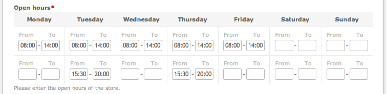

# Widget Hours extension for Contao Open Source CMS

Widget Hours is an extension for the [Contao Open Source CMS](https://contao.org).

Contao widget to enter hours for each day of the week. The amount of rows as well as the starting day of the week is 
fully configurable.

## Documentation

[Read the documentation](docs/README.md)

## Copyright

This project has been created and is maintained by [Codefog](https://codefog.pl).